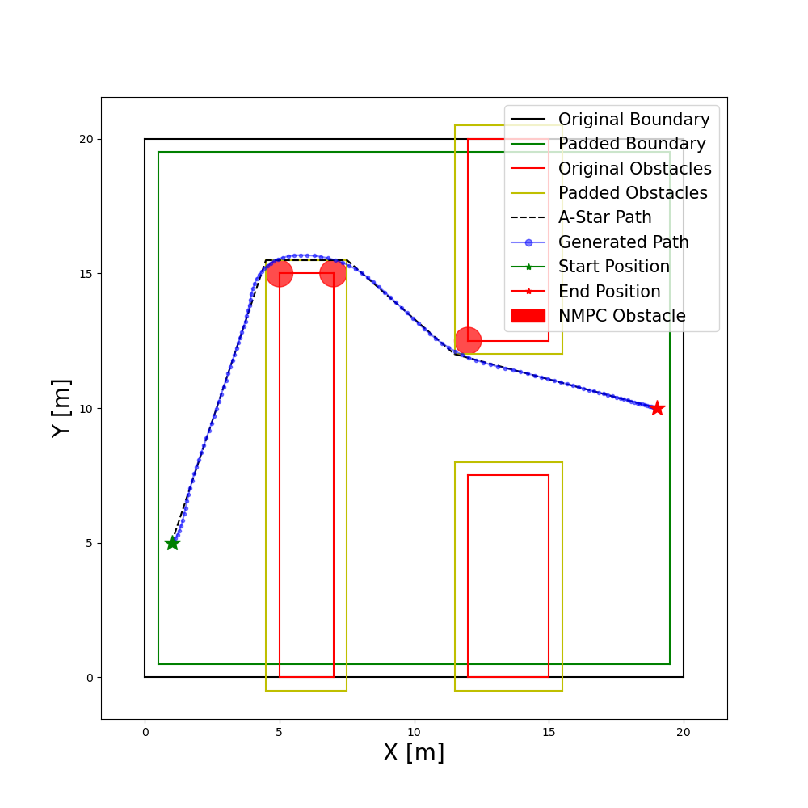

# MPC Trajectory Generator with Motion Prediction from MDN
This is a trajectory generator for mobile robots based on MPC and motion prediction results from MDN (Mixture Density Network). This generator is designed to solve static and dynamic obstacle avoidance problem, besides providing a feasible trajectory given the kinematic properties of the robot. The new structure tries to separate different functions with better interfaces. Find more in the comments of [main.py](src/main.py).

## Original Work
This code is originally from [mpc-trajectory-generator](https://github.com/wljungbergh/mpc-trajectory-generator) where you can also find the related paper published in IEEE CASE2021. Here, the code is restructured and stuffed with extra code to not only make it easier to read but also introduce other forms of dynamic obstacles. Please refer to the original code if you don't consider the MDN part.


## MDN Part
The MDN part can be find in [Multimodal Motion Prediction - Evaluation Version](https://github.com/Woodenonez/multimodal_motion_prediction).
The related paper is "Motion Prediction Based on Multiple Futures for Dynamic Obstacle Avoidance of Mobile Robots." published in CASE2021 as well.

## Dependencies

### OpEn
The NMPC formulation is solved using open source implementation of PANOC, namely [OpEn](https://alphaville.github.io/optimization-engine/). Follow the [installation instructions](https://alphaville.github.io/optimization-engine/docs/installation) before proceeding. 
### Python depecencies
To install all neccessary requirements (assuming you are using Anaconda), easiest way is to create an environment by navigating to the root of this repo and run 
   ```
   conda env create -f env/environment.yml
   ```

Activate the environment using
   ```
   conda activate TrajGen
   ```
   
If the environment file is changed, simply update an existing environment by running (at root of repo)
   ```
   conda env update -f env/environment.yml --prune
   ```

## Algorithm 
The algorithm is explained in detail in the accompinying paper (in the original Github repo). In summary, the algorithm models the environment as polygons and find the shortest path using A*, implemented in the [extremitypathfinder](https://github.com/MrMinimal64/extremitypathfinder) python package. This path is then followed by an NMPC controller to generate a smooth trajectory for a differential drive robot. 

## Quick Start
The algorithm can be run by running [main.py](src/main.py), make sure to set `init_build=True` if the NPMC solver hasn't been built before or if the configuration yaml file is changed.
There are two sets of simulation environment available now: **test** and **FTD** (SDD not finished yet). To switch the environment, you need to change the import class in [main.py](src/main.py) and [trajectory_generator.py](src/trajectory_generator.py). Specifically, in [map_generator](src/map_generator) and [obstacle_scanner](src/obstacle_scanner), switch files between 'test' and 'ftd'.
By changing `graph`, different predefined scenarios in test environment can be run. The configuration file is in [configs](configs). **Note**, some of the config parameters require a rebuild of the NMPC solver to take effect. 
There are some settings like 'json_path' can be changed in [ftd_obstacle_scanner](src/obstacle_scanner/ftd_dynamic_obstacles). Change them, exspecially json file path to make it work.

Scenarios can easily be created by using the GUI implemented in [draw_graph_tool.py](src/utils/draw_graph_tool.py).


